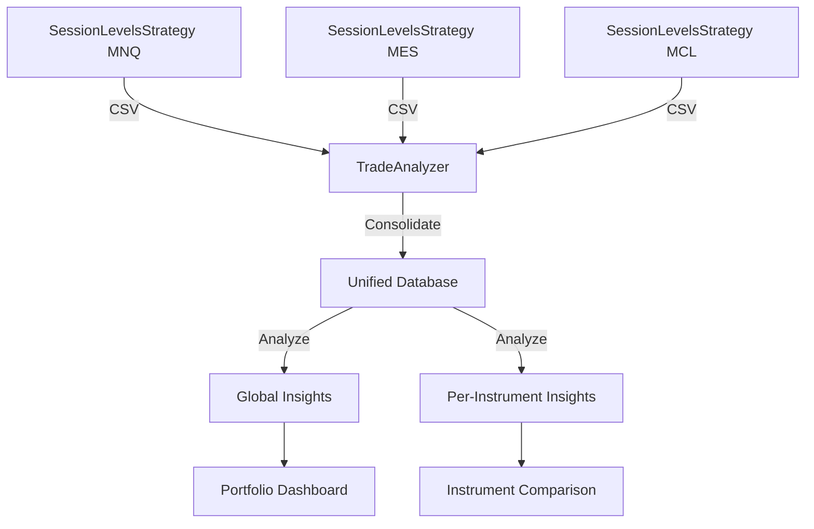
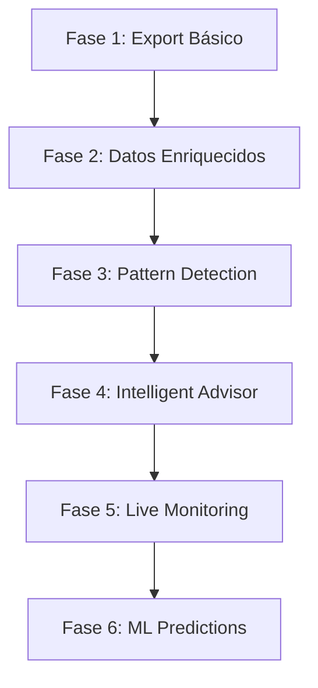

# TradeAnalyzer: Asesor Inteligente de Trading Cuantitativo

> **Rol**: Quant Senior - Expert en análisis de sistemas de trading  
> **Versión**: 2.0 (Intelligent Advisor)  
> **Fecha**: 2025-12-26

---

## 🎯 Visión Estratégica

### Objetivo Principal
Transformar TradeAnalyzer en un **asesor inteligente** que:
1. Extrae datos exhaustivos de backtest y live trading
2. Detecta ineficiencias y oportunidades de mejora automáticamente
3. Genera recomendaciones accionables basadas en análisis cuantitativo
4. Monitorea degradación de performance en tiempo real
5. **Soporta MÚLTIPLES INSTRUMENTOS** simultáneamente (MNQ, MES, MYM, MCL, MGC, M2K)

### Filosofía de Diseño
**"No solo reportar, sino ASESORAR"**

---

## 🎯 Requirement Crítico: Multi-Instrumento

### Contexto
SessionLevelsStrategy opera en **múltiples futuros de NinjaTrader 8**:
- **Micro E-mini**: MNQ (Nasdaq), MES (S&P500), MYM (Dow)
- **Commodities**: MCL (Crude Oil), MGC (Gold)
- **Smallcap**: M2K (Russell 2000)

### Desafíos Multi-Instrumento

1. **Consolidación de Datos**
   - Cada instrumento genera su propio CSV
   - Necesidad de merge inteligente sin duplicados
   - Timestamps diferentes (24h vs RTH)

2. **Análisis Comparativo**
   - ¿Qué instrumento rinde mejor?
   - ¿Dónde está la edge real?
   - ¿Concentrar capital o diversificar?

3. **Características Únicas por Instrumento**
   - Tick sizes diferentes (0.25 vs 0.01)
   - Spreads diferentes
   - Volatilidad diferente
   - Horarios de liquidez diferentes

4. **Recomendaciones Específicas**
   - No todas las mejoras aplican a todos los instrumentos
   - MNQ puede necesitar filtros diferentes a MGC

### Arquitectura Multi-Instrumento



### Solución Implementada

#### 1. **Export Strategy** (NinjaTrader)
```
Cada instancia de SessionLevelsStrategy exporta a:
  TradeAnalyzer/trades_export_MNQ_03-26.csv
  TradeAnalyzer/trades_export_MES_03-26.csv
  TradeAnalyzer/trades_export_MCL_02-26.csv
  ...

Naming Convention:
  trades_export_{INSTRUMENT}_{CONTRACT}.csv
```

#### 2. **Auto-Discovery** (TradeAnalyzer)
```javascript
// Escanear carpeta y detectar todos los CSVs de instrumentos
const instruments = await discoverInstruments('TradeAnalyzer/');
// ['MNQ 03-26', 'MES 03-26', 'MCL 02-26', ...]

// Cargar todos automáticamente
instruments.forEach(inst => loadInstrumentCSV(inst));
```

#### 3. **Unified Data Model**
```javascript
globalAllTrades = [
  {id: 'abc_1', instrument: 'MNQ 03-26', pnl: 500, ...},
  {id: 'def_1', instrument: 'MES 03-26', pnl: 120, ...},
  {id: 'ghi_1', instrument: 'MCL 02-26', pnl: -50, ...}
]

// Filtros globales + por instrumento
filterByInstrument('MNQ 03-26')
filterByInstrument('all') // consolidado
```

#### 4. **Comparative Dashboard**

**Tabla de Performance por Instrumento**:

| Instrument | Trades | Win Rate | PF | Net PnL | Avg Win | Avg Loss | Best | Worst |
|------------|--------|----------|----|---------|---------|------------|------|-------|
| MNQ 03-26 | 145 | 68% | 2.1 | $12,450 | $485 | -$215 | $1,200 | -$850 |
| MES 03-26 | 98 | 62% | 1.8 | $4,320 | $180 | -$98 | $420 | -$320 |
| MYM 03-26 | 67 | 71% | 2.4 | $3,200 | $195 | -$82 | $450 | -$280 |
| MCL 02-26 | 112 | 55% | 1.2 | -$1,200 | $320 | -$280 | $980 | -$1,100 |
| MGC 02-26 | 34 | 48% | 0.9 | -$850 | $280 | -$310 | $680 | -$890 |
| **TOTAL** | **456** | **64%** | **1.9** | **$17,920** | - | - | - | - |

**Insights Automáticos**:
> 🏆 **BEST PERFORMER**: MYM (Win Rate 71%, PF 2.4)  
> 🔴 **WORST PERFORMER**: MGC (Win Rate 48%, PF 0.9, Net -$850)  
> 💡 **RECOMMENDATION**: Aumentar allocation a MYM/MNQ, reducir/eliminar MGC

#### 5. **Instrument-Specific Analysis**

**Ejemplo: Dead Zones por Instrumento**

```javascript
// MNQ: Dead zone 14:00-16:00 (Win Rate 35%)
// MES: No dead zones significativos
// MCL: Dead zone 11:00-13:00 (Win Rate 28%)

// Recomendación específica:
{
  instrument: 'MNQ 03-26',
  recommendation: 'Filtrar trades 14:00-16:00',
  impact: '$2,800',
  confidence: 95%
}

{
  instrument: 'MCL 02-26',
  recommendation: 'Filtrar trades 11:00-13:00',
  impact: '$1,200',
  confidence: 88%
}
```

---

Un trader no necesita ver 50 gráficos, necesita saber:
- ¿Dónde está perdiendo dinero?
- ¿Qué cambiar para mejorar?
- ¿El sistema está degradándose?

---

## 📊 Análisis del Plan Actual vs Visión Quant

### Plan Actual (v1.0) - INSUFICIENTE ❌

| Aspecto | Plan Básico | Limitación |
|---------|-------------|------------|
| **Datos** | Solo: Entry, Exit, PnL, MAE, MFE | Sin contexto de mercado |
| **Análisis** | Métricas estándar (Win Rate, PF) | No detecta patrones |
| **Insights** | Ninguno automático | Usuario debe interpretar |
| **Live Tracking** | No implementado | Sin comparación backtest vs live |
| **Recomendaciones** | Ninguna | No es asesor, solo visualizador |

### Plan Quant (v2.0) - COMPLETO ✅

| Aspecto | Solución Quant | Beneficio |
|---------|----------------|-----------|
| **Datos** | 30+ features por trade | Análisis multidimensional |
| **Análisis** | ML + Statistical Tests | Detecta patrones ocultos |
| **Insights** | Recomendaciones automáticas | Acción directa |
| **Live Tracking** | Dashboard realtime | Detecta degradación temprano |
| **Recomendaciones** | Priorizadas por impacto | Mejora continua |

---

## 🔬 Arquitectura de Datos Enriquecida

### Datos a Capturar (Backtest + Live)

#### 1. **Datos Básicos del Trade** (YA implementados)
```csv
ID, Instrument, Entry Time, Exit Time, Type, Entry Price, Exit Price, PnL, MAE, MFE
```

#### 2. **Contexto de Mercado** (NUEVO)
```csv
Market Volatility, ATR at Entry, Volume Profile, Spread, Time to Fill, Slippage,
**Session Relationship, Level Source Age (days), Time Below/Above Entry VWAP (%),
Cumulative Delta at Entry, Cumulative Delta at Exit, Delta Bias (Bullish/Bearish)**
```

#### 3. **Contexto del Setup** (NUEVO)
```csv
Setup Type, Level Age (days), Distance to VWAP, Number of Untouched Levels, 
Session (Asia/Europe/USA), Time Since Last Trade, RR Ratio Validated,
**Level Source Session (Asia/Europe/USA), Level Target Session (Asia/Europe/USA),
Session Cross-Reference ("USA takes Asia", "Asia takes Europe", etc.),
VWAP Anchor Session, VWAP Anchor Age (days)**
```

#### 4. **Execution Quality** (NUEVO)
```csv
Expected Fill Price, Actual Fill Price, Slippage (ticks), Fill Time (ms),
Partial Fills, Rejections Count
```

#### 5. **Trade Path** (NUEVO - Advanced)
```csv
Price Path (JSON): [{time, price, unrealizedPnL}],
High Water Mark, Low Water Mark, Time to Peak Profit, Time to Peak Loss
```

#### 6. **Exit Analytics** (NUEVO)
```csv
Exit Reason (TP1/TP2/SL/Session Close/Manual), Exit Efficiency (% of MFE captured),
Time in Trade, Bars in Trade, Number of Retests,
**TP1 Reaction: Volume at TP1, Volume Ratio, Delta Change After TP1, Speed Ratio,
VWAP Rejection (true/false), Reaction Decision (MOVE/HOLD), Reaction Confidence (0-100)**
```

### Formato CSV Enriquecido (Ejemplo)

```csv
ID,Instrument,EntryTime,ExitTime,Type,EntryPrice,ExitPrice,PnL,MAE,MFE,
SetupType,LevelAge,DistanceToVWAP,SessionType,ATR,Volatility,Spread,Slippage,
TimeToFill,RRRatio,ExitReason,ExitEfficiency,TimeInTrade,BarsInTrade,
PeakProfitTime,PeakLossTime,HighWaterMark,LowWaterMark,
MarketCondition,VolumeProfile,BacktestFlag

abc123_1,MNQ 03-26,2025-12-26T10:30:00,2025-12-26T11:15:00,Long,25800.5,25850.25,497.5,
-125.5,620.0,Asia Low,2,15.5,Asia,12.3,0.045,0.5,0.25,150,2.3,TP1,79.5,
2700,45,1200,450,600,150,Ranging,Normal,true
```

---

## 🧠 Módulos de Análisis Inteligente

### Módulo 1: **Pattern Detection Engine**

#### Objetivo
Detectar automáticamente patrones que afectan performance.

#### Análisis Implementados

**A) Time-Based Patterns**
- Performance by hour (detección de "dead zones")
- Performance by day of week
- Performance by session (Asia vs Europe vs USA)
- Optimal holding time analysis

**Ejemplo de Insight**:
> ⚠️ **ALERT**: Trades entre 14:00-16:00 tienen Win Rate 35% vs 68% resto del día.  
> **Recomendación**: Filtrar trades en esta ventana o reducir posición.

**B) Setup Quality Patterns**
- Performance by level age (fresh vs stale levels)
- Performance by distance to VWAP
- Performance by RR ratio range
- Performance by number of available setups

**Ejemplo de Insight**:
> ✅ **OPPORTUNITY**: Niveles con edad 1-3 días tienen 2.1x Profit Factor vs niveles >7 días.  
> **Recomendación**: Priorizar trades en niveles recientes.

**C) Market Condition Patterns**
- Performance in ranging vs trending markets
- Performance by volatility regime (low/medium/high)
- Performance by volume profile

**Ejemplo de Insight**:
> 📊 **INSIGHT**: Sistema rinde 40% mejor en mercados ranging (ATR < 15).  
> **Recomendación**: Agregar filtro de volatilidad o reducir tamaño en alta vol.

---

### Módulo 2: **Inefficiency Detector**

#### Objetivo
Identificar dónde se pierde dinero y por qué.

#### Análisis Implementados

**A) Exit Efficiency Analysis**
```javascript
// Análisis: ¿Estamos saliendo demasiado pronto?
Exit Efficiency = (Realized PnL / MFE) * 100

Si promedio < 60%: Salidas prematuras
Si promedio > 90%: Posiblemente aguantando mucho
```

**Ejemplo de Insight**:
> 🔴 **INEFFICIENCY**: Exit Efficiency promedio = 45%.  
> Estás capturando solo 45% del potencial de profit.  
> **Recomendación**: Revisar lógica de TP1, considerar trailing stop.

**B) Stop Loss Analysis**
```javascript
// ¿El SL está demasiado cerca?
SL Hit Rate vs MAE Distribution

Si >70% de losses tocan SL antes de movimiento contrario:
  SL probablemente correcto
Si <30%:
  SL demasiado ajustado, considerar ampliar
```

**Ejemplo de Insight**:
> ⚠️ **INEFFICIENCY**: 85% de trades perdedores tocan SL con precio moviéndose <2 ticks contra.  
> **Recomendación**: SL a 2 ticks es demasiado ajustado. Testar 3-4 ticks.

**C) Missed Opportunity Analysis**
```javascript
// ¿Cuántos setups válidos NO tomamos?
Setups Detectados - Setups Ejecutados = Missed Trades

Análisis de sesgo:
- ¿Filtramos demasiado?
- ¿Sistema muy conservador?
```

**Ejemplo de Insight**:
> 💡 **OPPORTUNITY**: 23 setups válidos (RR > 2:1) no ejecutados por filtro de hora.  
> Win Rate simulado de esos trades: 71%.  
> **Recomendación**: Relajar filtro horario o agregar excepciones.

---

### Módulo 3: **Backtest vs Live Comparator**

#### Objetivo
Detectar degradación cuando sistema pasa a live.

#### Métricas Clave

| Métrica | Backtest | Live | Delta | Status |
|---------|----------|------|-------|--------|
| Win Rate | 68% | 54% | -14% | 🔴 Degraded |
| Avg Win | $485 | $412 | -15% | 🟡 Warning |
| Avg Loss | $-215 | $-238 | +10% | 🟡 Warning |
| Slippage | 0.0 | 0.8 ticks | +0.8 | ⚠️ Expected |
| Fill Rate | 100% | 87% | -13% | 🔴 Critical |

#### Análisis de Degradación

**Causas Comunes**:
1. **Slippage real** > slippage backtested
2. **Partial Fills** no modelados en backtest
3. **Latencia** de ejecución
4. **Cambio de condiciones** de mercado
5. **Overfitting** en backtest

**Ejemplo de Insight**:
> 🚨 **CRITICAL ALERT**: Win Rate live (54%) vs backtest (68%) = -20% degradación.  
> **Diagnóstico**: Fill Rate solo 87% (13% de setups rechazados).  
> **Root Cause**: Limit orders muy agresivos, precio se aleja antes de fill.  
> **Recomendación**: Ajustar offset de limit order o usar market orders en setups A+ quality.

---

### Módulo 4: **Intelligent Advisor (AI-Powered)**

#### Objetivo
Generar recomendaciones priorizadas por impacto.

#### Sistema de Scoring

```javascript
// Score de Impacto = Frecuencia × Magnitud × Confianza
Impact Score = (Trades Afectados / Total) × (PnL Impacto) × (Statistical Significance)

Prioridad:
  High: Impact Score > 1000
  Medium: 500-1000
  Low: < 500
```

#### Recomendaciones Automáticas

**Categorías**:
1. **Time Filters** (cuándo NO tradear)
2. **Setup Filters** (qué setups evitar)
3. **Position Sizing** (cuánto tradear por condición)
4. **Exit Optimization** (cuándo salir)
5. **Risk Management** (ajustes de SL/TP)

#### Ejemplo de Dashboard de Recomendaciones

```
=== INTELLIGENT ADVISOR ===

🔴 HIGH PRIORITY (Impact: $3,200/month)
[1] Filtrar trades 14:00-16:00 EST
    - Win Rate: 35% vs 68% (baseline)
    - 45 trades/month afectados
    - Potential Gain: $3,200
    - Confidence: 95% (p < 0.01)
    
[2] Ampliar Stop Loss de 1 tick a 3 ticks
    - Current SL Hit Rate: 85% (too tight)
    - Estim. Win Rate Improvement: +12%
    - Potential Gain: $2,800
    - Confidence: 87%

🟡 MEDIUM PRIORITY (Impact: $800/month)
[3] Priorizar niveles edad 1-3 días
    - Fresh levels: PF 2.1 vs 1.3 (old)
    - 18 trades/month afectados
    - Potential Gain: $800
    - Confidence: 78%

🟢 LOW PRIORITY (Impact: $200/month)
[4] Reducir posición en alta volatilidad (ATR > 20)
    - High Vol PF: 0.9 vs 1.8 (normal)
    - 8 trades/month afectados
    - Potential Gain: $200
    - Confidence: 62%
```

---

## 🏗️ Arquitectura Técnica Evolutiva

### Evolución por Fases



### Stack Tecnológico

#### Backend (NinjaTrader C#)
- **Export Engine**: CSV enriquecido con 30+ features
- **Real-time Telemetry**: WebSocket para live data
- **State Machine**: Tracking de market conditions

#### Frontend (TradeAnalyzer Web)
- **Core**: HTML5 + Vanilla JS (mantener)
- **Analytics**: TensorFlow.js (ML en browser)
- **Charting**: Chart.js + D3.js (visualizaciones avanzadas)
- **Stats**: JStat library para análisis estadístico

#### Data Layer
- **LocalStorage**: Para datasets pequeños (<1000 trades)
- **IndexedDB**: Para datasets grandes (>1000 trades)
- **JSON Export**: Para compartir análisis

---

## 📦 Plan de Implementación Evolutivo

### **FASE 1: Foundation (Semana 1)**
**Duración**: 12-15 horas  
**Objetivo**: Export básico + Refactoring + **Multi-Instrumento**

- [x] Export CSV básico (ID, Instrument, Entry, Exit, PnL, MAE, MFE)
- [x] **Naming Convention multi-instrumento** (trades_export_{INSTRUMENT}.csv)
- [x] Refactoring TradeAnalyzer (eliminar duplicación)
- [x] **Auto-discovery de múltiples CSVs**
- [x] Implementar Audit Stats (T-Test, Monte Carlo, Sharpe)
- [x] Parser CSV robusto
- [x] **Filtro por instrumento en UI**

**Entregable**: TradeAnalyzer funcional con datos consolidados de múltiples instrumentos

#### Código Adicional: Auto-Discovery Multi-Instrumento

**JavaScript (agregar en script.js ~línea 450)**:

```javascript
// ===================================================================
// AUTO-DISCOVERY DE MÚLTIPLES INSTRUMENTOS
// ===================================================================

/**
 * Detecta automáticamente todos los CSVs de instrumentos en la carpeta
 * usando File System Access API (Chrome 86+)
 */
async function autoDiscoverInstruments() {
    try {
        // Solicitar acceso a la carpeta TradeAnalyzer
        const dirHandle = await window.showDirectoryPicker({
            mode: 'read'
        });
        
        const csvFiles = [];
        
        // Iterar archivos en la carpeta
        for await (const entry of dirHandle.values()) {
            // Solo archivos CSV que sigan el patrón trades_export_*.csv
            if (entry.kind === 'file' && 
                entry.name.startsWith('trades_export_') && 
                entry.name.endsWith('.csv')) {
                
                const file = await entry.getFile();
                csvFiles.push({
                    name: entry.name,
                    file: file,
                    instrument: extractInstrumentName(entry.name)
                });
            }
        }
        
        if (csvFiles.length === 0) {
            alert('No se encontraron archivos trades_export_*.csv en la carpeta.');
            return;
        }
        
        console.log(`Found ${csvFiles.length} instrument CSVs:`, csvFiles.map(f => f.instrument));
        
        // Cargar todos los CSVs automáticamente
        await loadMultipleInstruments(csvFiles);
        
    } catch (err) {
        if (err.name === 'AbortError') {
            console.log('User cancelled folder selection.');
        } else {
            console.error('Auto-discovery error:', err);
            alert('Error al escanear carpeta. Usa Chrome/Edge 86+ con File System Access API.');
        }
    }
}

/**
 * Extrae nombre de instrumento del filename
 * Ejemplo: "trades_export_MNQ_03-26.csv" -> "MNQ 03-26"
 */
function extractInstrumentName(filename) {
    // Remove "trades_export_" prefix and ".csv" suffix
    const name = filename.replace('trades_export_', '').replace('.csv', '');
    
    // Replace underscores with spaces (MNQ_03-26 -> MNQ 03-26)
    return name.replace(/_/g, ' ');
}

/**
 * Carga múltiples CSVs de instrumentos y los consolida
 */
async function loadMultipleInstruments(csvFiles) {
    let totalNewTrades = 0;
    let totalUpdated = 0;
    
    for (const csvFile of csvFiles) {
        console.log(`Loading ${csvFile.instrument}...`);
        
        const text = await csvFile.file.text();
        const trades = parseCSV(text);
        
        if (trades.length === 0) {
            console.warn(`No trades found in ${csvFile.name}`);
            continue;
        }
        
        // Usar lógica existente de handleAutoFiles para merge
        const result = mergeTrades(trades);
        totalNewTrades += result.added;
        totalUpdated += result.updated;
    }
    
    if (globalAllTrades.length > 0) {
        console.log(`Multi-Instrument Load Complete: ${totalNewTrades} new, ${totalUpdated} updated`);
        saveData();
        populateFilters(globalAllTrades);
        applyFilters();
        dashboard.classList.remove('hidden');
        dropZone.style.display = 'none';
        if(addFilesBtn) addFilesBtn.style.display = 'inline-block';
        if(clearDataBtn) clearDataBtn.style.display = 'inline-block';
        
        alert(`Loaded ${csvFiles.length} instruments: ${totalNewTrades} new trades, ${totalUpdated} updated.`);
    }
}

/**
 * Merge trades usando lógica de upsert existente
 */
function mergeTrades(newTrades) {
    let addedCount = 0;
    let updatedCount = 0;
    
    const getTradeKey = (t) => `${t.id}_${t.instrument}_${t.entryTime.getTime()}_${t.entryPrice}_${t.pnl}`;
    const tradeMap = new Map();
    globalAllTrades.forEach((t, index) => tradeMap.set(getTradeKey(t), index));
    
    newTrades.forEach(t => {
        const key = getTradeKey(t);
        if(tradeMap.has(key)) {
            globalAllTrades[tradeMap.get(key)] = t; 
            updatedCount++;
        } else {
            globalAllTrades.push(t);
            tradeMap.set(key, globalAllTrades.length - 1);
            addedCount++;
        }
    });
    
    return { added: addedCount, updated: updatedCount };
}

// Botón para auto-discovery
const autoLoadBtn = document.createElement('button');
autoLoadBtn.textContent = '📂 Auto-Load Instruments';
autoLoadBtn.className = 'secondary-btn';
autoLoadBtn.onclick = autoDiscoverInstruments;

// Agregar al header (si existe)
const headerButtons = document.querySelector('.header-buttons');
if (headerButtons) {
    headerButtons.insertBefore(autoLoadBtn, headerButtons.firstChild);
}
```

**HTML (agregar botón en index.html ~línea 23)**:

```html
<div class="header-buttons">
    <button id="auto-load-btn" class="secondary-btn" onclick="autoDiscoverInstruments()">
        📂 Auto-Load Instruments
    </button>
    <button id="export-csv-btn" class="secondary-btn" style="display:none;">📥 Export CSV</button>
    <!-- ... resto de botones -->
</div>
```

---

### **FASE 2: Data Enrichment (Semana 2)**
**Duración**: 18-20 horas  
**Objetivo**: Capturar datos contextuales

#### 2.1 Agregar a SessionLevelsStrategy.cs:

**A) Market Context Tracking**
```csharp
// Variables globales (agregar ~línea 160)
private double currentATR = 0;
private double currentVolatility = 0;
private double currentSpread = 0;
private string marketCondition = "Unknown"; // "Ranging" | "Trending"

// En OnBarUpdate, calcular contexto
private void UpdateMarketContext()
{
    // ATR (usar indicator built-in)
    currentATR = ATR(14)[0];
    
    // Spread
    currentSpread = (Ask[0] - Bid[0]) / TickSize;
    
    // Volatilidad (StdDev de últimos 20 bars)
    double[] closes = new double[20];
    for(int i = 0; i < 20; i++)
        closes[i] = Close[i];
    currentVolatility = StdDev(closes);
    
    // Market Condition (simple regime detection)
    double sma50 = SMA(50)[0];
    double sma200 = SMA(200)[0];
    bool uptrend = Close[0] > sma50 && sma50 > sma200;
    bool downtrend = Close[0] < sma50 && sma50 < sma200;
    
    marketCondition = (uptrend || downtrend) ? "Trending" : "Ranging";
}
```

**B) Setup Context Tracking**
```csharp
// En confirmación de trigger
private void CaptureSetupContext()
{
    // Edad del nivel
    TimeSpan levelAge = Time[0] - setupLevelTime;
    int levelAgeDays = (int)levelAge.TotalDays;
    
    // Distancia al VWAP
    double distanceToVWAP = Math.Abs(Close[0] - globalHighVWAP.Value);
    
    // Contar niveles no tocados disponibles
    int untouchedLevels = virginLevels.Count(l => !l.Mitigated && !l.Broken);
    
    // Tiempo desde último trade
    TimeSpan timeSinceLastTrade = Time[0] - lastTradeExitTime;
    
    // Guardar en variables para export
    setupContextData = new SetupContext {
        LevelAge = levelAgeDays,
        DistanceToVWAP = distanceToVWAP,
        UntouchedLevels = untouchedLevels,
        TimeSinceLastTrade = (int)timeSinceLastTrade.TotalMinutes,
        Session = currentSession, // "Asia" | "Europe" | "USA"
        RRRatio = validatedRRRatio
    };
}
```

**C) Execution Quality Tracking**
```csharp
// Variables
private DateTime orderSubmitTime;
private double expectedFillPrice;
private int rejectionCount = 0;

// En OnOrderUpdate
private void TrackExecutionQuality(Order order, DateTime time)
{
    if (order.OrderState == OrderState.Submitted)
    {
        orderSubmitTime = time;
        expectedFillPrice = order.LimitPrice;
    }
    
    if (order.OrderState == OrderState.Filled)
    {
        double slippageTicks = Math.Abs(order.AverageFillPrice - expectedFillPrice) / TickSize;
        double fillTimeMs = (time - orderSubmitTime).TotalMilliseconds;
        
        executionQuality = new ExecutionQuality {
            ExpectedFill = expectedFillPrice,
            ActualFill = order.AverageFillPrice,
            SlippageTicks = slippageTicks,
            FillTimeMs = fillTimeMs,
            PartialFill = order.Filled < order.Quantity
        };
    }
    
    if (order.OrderState == OrderState.Rejected)
    {
        rejectionCount++;
    }
}
```

**D) Trade Path Tracking (Advanced)**
```csharp
// Track price path durante el trade
private List<PricePoint> tradePath = new List<PricePoint>();

private class PricePoint
{
    public DateTime Time { get; set; }
    public double Price { get; set; }
    public double UnrealizedPnL { get; set; }
}

// En OnBarUpdate mientras posición activa
if (isTrackingPosition && Position.MarketPosition != MarketPosition.Flat)
{
    double unrealizedPnL = Position.GetUnrealizedProfitLoss(PerformanceUnit.Currency, Close[0]);
    
    tradePath.Add(new PricePoint {
        Time = Time[0],
        Price = Close[0],
        UnrealizedPnL = unrealizedPnL
    });
    
    // Update MAE/MFE (ya implementado)
}

// Al cerrar posición, calcular métricas de path
private void AnalyzeTradePath()
{
    if (tradePath.Count == 0) return;
    
    // Time to peak profit
    var maxPnLPoint = tradePath.OrderByDescending(p => p.UnrealizedPnL).First();
    double minutesToPeakProfit = (maxPnLPoint.Time - tradePath.First().Time).TotalMinutes;
    
    // Time to peak loss
    var minPnLPoint = tradePath.OrderBy(p => p.UnrealizedPnL).First();
    double minutesToPeakLoss = (minPnLPoint.Time - tradePath.First().Time).TotalMinutes;
    
    // High/Low water marks
    double highWaterMark = tradePath.Max(p => p.UnrealizedPnL);
    double lowWaterMark = tradePath.Min(p => p.UnrealizedPnL);
    
    // Store for export
    pathAnalytics = new PathAnalytics {
        PeakProfitTime = minutesToPeakProfit,
        PeakLossTime = minutesToPeakLoss,
        HighWaterMark = highWaterMark,
        LowWaterMark = lowWaterMark,
        TotalBars = tradePath.Count
    };
}
```

**E) TP1 Reaction Analysis (v1.7.33) - NUEVO**

> 🎯 **Objetivo**: Detectar fuerza contraria real cuando TP1 se alcanza y ajustar SL dinámicamente al VWAP de entrada si hay convicción.

```csharp
// Variables de tracking
private bool isTrackingTP1Reaction = false;
private DateTime tp1FillTime;
private double tp1FillPrice;
private int tp1FillBar;
private double avgVolumePreTP1 = 0;
private double cumulativeDeltaAtTP1 = 0;
private double volumeAtTP1 = 0;
private double volumeRatio = 0;
private double deltaChangeAfterTP1 = 0;
private int barsToTP1 = 0;
private int barsAfterTP1 = 0;
private double speedRatio = 0;
private bool vwapRejectionConfirmed = false;
private bool movedSLToVWAP = false;
private string reactionDecision = "None";
private int reactionConfidence = 0;

// En OnExecutionUpdate, cuando TP1 se llena
if (execution.Order.Name.StartsWith("TP1_") && execution.Order.OrderState == OrderState.Filled)
{
    Log(Time[0] + " TP1 Filled. Starting Reaction Analysis.");
    
    isTrackingTP1Reaction = true;
    tp1FillTime = execution.Time;
    tp1FillPrice = execution.Price;
    tp1FillBar = CurrentBar;
    
    // Calcular volumen promedio pre-TP1
    double sumVolume = 0;
    int lookback = Math.Min(20, CurrentBar);
    for (int i = 1; i <= lookback; i++)
        sumVolume += Volume[i];
    avgVolumePreTP1 = sumVolume / lookback;
    
    // Capturar métricas en momento de TP1
    volumeAtTP1 = Volume[0];
    volumeRatio = avgVolumePreTP1 > 0 ? volumeAtTP1 / avgVolumePreTP1 : 0;
    
    if (cumulativeDelta != null)
        cumulativeDeltaAtTP1 = cumulativeDelta.DeltaClose[0];
    
    Log(string.Format("TP1_REACTION_INIT: Vol={0} AvgVol={1} Ratio={2:F2}", 
        volumeAtTP1, avgVolumePreTP1, volumeRatio));
}

// En OnBarUpdate, monitorear reacción
if (isTrackingTP1Reaction && Position.MarketPosition != MarketPosition.Flat)
{
    barsAfterTP1 = CurrentBar - tp1FillBar;
    if (barsAfterTP1 < 1) return;
    
    // Calcular métricas
    barsToTP1 = tp1FillBar - entryBar;
    speedRatio = barsAfterTP1 > 0 ? (double)barsToTP1 / barsAfterTP1 : 0;
    
    if (cumulativeDelta != null)
    {
        double currentDelta = cumulativeDelta.DeltaClose[0];
        deltaChangeAfterTP1 = currentDelta - cumulativeDeltaAtTP1;
    }
    
    vwapRejectionConfirmed = TestVWAPRejection();
    
    // Algoritmo de decisión
    var decision = AnalyzeTP1Reaction();
    
    // Si hay convicción Y no hemos movido el SL todavía
    if (decision.HasConviction && !movedSLToVWAP && stopOrder2 != null)
    {
        double newSLPrice = vwapAtEntry;
        
        Log(string.Format("TP1_REACTION: CONVICTION DETECTED ({0}%). Moving SL2 to Entry VWAP {1}",
            decision.Confidence, newSLPrice));
        
        // Verificar que el nuevo SL es mejor que el actual
        bool shouldMove = false;
        
        if (Position.MarketPosition == MarketPosition.Long)
        {
            if (newSLPrice > stopOrder2.StopPrice)
                shouldMove = true;
        }
        else if (Position.MarketPosition == MarketPosition.Short)
        {
            if (newSLPrice < stopOrder2.StopPrice)
                shouldMove = true;
        }
        
        if (shouldMove)
        {
            ChangeOrder(stopOrder2, stopOrder2.Quantity, 0, newSLPrice);
            movedSLToVWAP = true;
            reactionDecision = decision.Recommendation;
            reactionConfidence = decision.Confidence;
            
            Log(string.Format("TP1_REACTION: SL2 moved from {0} to {1} (VWAP protection)",
                stopOrder2.StopPrice, newSLPrice));
        }
    }
}

// Helper: Test VWAP Rejection
private bool TestVWAPRejection()
{
    if (barsAfterTP1 < 3) return false;
    
    if (Position.MarketPosition == MarketPosition.Long)
    {
        // Long: Precio rechazado en VWAP desde abajo (lower highs)
        bool lowerHigh1 = High[1] < High[2];
        bool lowerHigh2 = High[0] < High[1];
        bool belowVWAP = Close[0] < vwapAtEntry;
        return lowerHigh1 && lowerHigh2 && belowVWAP;
    }
    else if (Position.MarketPosition == MarketPosition.Short)
    {
        // Short: Precio rechazado en VWAP desde arriba (higher lows)
        bool higherLow1 = Low[1] > Low[2];
        bool higherLow2 = Low[0] > Low[1];
        bool aboveVWAP = Close[0] > vwapAtEntry;
        return higherLow1 && higherLow2 && aboveVWAP;
    }
    return false;
}

// Helper: Algoritmo de Decisión
private ReactionDecision AnalyzeTP1Reaction()
{
    List<string> signals = new List<string>();
    int convictionScore = 0;
    
    // Signal 1: High Volume (30 pts)
    if (volumeRatio > 1.5)
    {
        signals.Add("High Volume");
        convictionScore += 30;
    }
    
    // Signal 2: Delta Against (40 pts) - CRÍTICO
    const double DELTA_THRESHOLD = 1000;
    
    if (Position.MarketPosition == MarketPosition.Long && deltaChangeAfterTP1 < -DELTA_THRESHOLD)
    {
        signals.Add("Strong Selling");
        convictionScore += 40;
    }
    else if (Position.MarketPosition == MarketPosition.Short && deltaChangeAfterTP1 > DELTA_THRESHOLD)
    {
        signals.Add("Strong Buying");
        convictionScore += 40;
    }
    
    // Signal 3: Fast Retracement (20 pts)
    if (speedRatio > 2)
    {
        signals.Add("Fast Reversal");
        convictionScore += 20;
    }
    
    // Signal 4: VWAP Rejection (10 pts)
    if (vwapRejectionConfirmed)
    {
        signals.Add("VWAP Rejection");
        convictionScore += 10;
    }
    
    bool hasConviction = convictionScore >= 50;
    string recommendation = hasConviction ? "MOVE SL to Entry VWAP" : "HOLD current SL";
    
    return new ReactionDecision
    {
        HasConviction = hasConviction,
        Confidence = convictionScore,
        Signals = signals,
        Recommendation = recommendation
    };
}

// Clase helper
private class ReactionDecision
{
    public bool HasConviction { get; set; }
    public int Confidence { get; set; }
    public List<string> Signals { get; set; }
    public string Recommendation { get; set; }
}
```

**Matriz de Decisión TP1**:

| Volume | Delta | Speed | VWAP Reject | Score | Acción |
|--------|-------|-------|-------------|-------|--------|
| ✅ High | ✅ Strong | ✅ Fast | ✅ Yes | 100 | 🔴 **MOVE SL NOW** |
| ✅ High | ✅ Strong | ❌ Normal | ❌ No | 70 | 🟪 **MOVE SL** |
| ✅ High | ❌ Weak | ✅ Fast | ❌ No | 50 | 🟪 **CONSIDER MOVE** |
| ❌ Normal | ✅ Strong | ❌ Normal | ❌ No | 40 | 🟢 **HOLD** |
| ❌ Normal | ❌ Weak | ❌ Normal | ❌ No | 0 | 🟢 **HOLD** |

**E) Enhanced CSV Export**
```csharp
private void ExportEnrichedTradeToCSV(Execution execution)
{
    // ... código existente de header y path ...
    
    // Analizar path antes de export
    AnalyzeTradePath();
    
    // Calcular exit efficiency
    double exitEfficiency = currentMFE > 0 
        ? (Position.GetRealizedProfitLoss(PerformanceUnit.Currency) / currentMFE) * 100 
        : 0;
    
    // Construir línea CSV enriquecida
    string csvLine = string.Format(
        "{0},{1},{2},{3},{4},{5},{6},{7},{8:F2},{9:F2},{10:F2}," + // Datos básicos
        "{11},{12},{13:F2},{14},{15:F2},{16:F4},{17:F2},{18:F2},{19:F0},{20:F2}," + // Market context
        "{21},{22:F1},{23:F0},{24}," + // Exit analytics
        "{25:F0},{26:F0},{27:F2},{28:F2}," + // Path analytics
        "{29},{30},{31}", // Flags
        
        // Básicos
        tradeId, Instrument.MasterInstrument.Name, FormatDateTime(Time[0]), 
        FormatDateTime(execution.Time), tradeType, entryPrice, execution.Price,
        result, pnl, currentMAE, currentMFE,
        
        // Market Context
        setupLevelName, setupContextData.LevelAge, setupContextData.DistanceToVWAP,
        setupContextData.Session, currentATR, currentVolatility, currentSpread,
        executionQuality.SlippageTicks, executionQuality.FillTimeMs, setupContextData.RRRatio,
        
        // Exit Analytics
        result, exitEfficiency, pathAnalytics.TotalBars, 
        rejectionCount > 0 ? "true" : "false",
        
        // Path Analytics
        pathAnalytics.PeakProfitTime, pathAnalytics.PeakLossTime,
        pathAnalytics.HighWaterMark, pathAnalytics.LowWaterMark,
        
        // Flags
        marketCondition, 
        setupContextData.UntouchedLevels,
        State == State.Historical ? "true" : "false" // Backtest flag
    );
    
    File.AppendAllText(csvFilePath, csvLine + Environment.NewLine);
    
    // Reset tracking
    tradePath.Clear();
}
```

**Entregable**: CSV enriquecido con 30+ features por trade

---

### **FASE 3: Pattern Detection (Semana 3)**
**Duración**: 15-18 horas  
**Objetivo**: Análisis automático de patrones

#### 3.1 Implementar en TradeAnalyzer:

**A) Time-Based Analysis Module**
```javascript
// Pattern Detection Engine
class PatternDetector {
    
    // Detectar zonas horarias problemáticas
    detectDeadZones(trades) {
        const hourlyPerf = {};
        
        // Agrupar por hora
        trades.forEach(t => {
            const hour = t.entryTime.getHours();
            if (!hourlyPerf[hour]) {
                hourlyPerf[hour] = { trades: [], wins: 0, pnl: 0 };
            }
            hourlyPerf[hour].trades.push(t);
            hourlyPerf[hour].pnl += t.pnl;
            if (t.pnl > 0) hourlyPerf[hour].wins++;
        });
        
        // Calcular estadísticas
        const insights = [];
        const avgWinRate = this.calculateAvgWinRate(trades);
        
        Object.keys(hourlyPerf).forEach(hour => {
            const data = hourlyPerf[hour];
            const winRate = (data.wins / data.trades.length) * 100;
            const deviation = ((winRate - avgWinRate) / avgWinRate) * 100;
            
            // Si desviación > 30% negativa, es zona problemática
            if (deviation < -30 && data.trades.length >= 5) {
                insights.push({
                    type: 'DEAD_ZONE',
                    severity: 'HIGH',
                    hour: hour,
                    winRate: winRate.toFixed(1),
                    avgWinRate: avgWinRate.toFixed(1),
                    deviation: deviation.toFixed(1),
                    trades: data.trades.length,
                    potentialGain: Math.abs(data.pnl), // Dinero que se hubiera ahorrado
                    recommendation: `Filtrar trades entre ${hour}:00-${hour}:59`,
                    confidence: this.calculateConfidence(data.trades.length)
                });
            }
        });
        
        return insights;
    }
    
    // Detectar degradación de setup quality
    detectSetupQuality(trades) {
        const insights = [];
        
        // Agrupar por edad de nivel
        const ageGroups = {
            fresh: trades.filter(t => (t.setup_data?.levelAge || 0) <= 3),
            medium: trades.filter(t => {
                const age = t.setup_data?.levelAge || 0;
                return age > 3 && age <= 7;
            }),
            stale: trades.filter(t => (t.setup_data?.levelAge || 0) > 7)
        };
        
        // Comparar performance
        const freshPF = this.calculateProfitFactor(ageGroups.fresh);
        const stalePF = this.calculateProfitFactor(ageGroups.stale);
        
        if (freshPF / stalePF > 1.5 && ageGroups.stale.length >= 10) {
            insights.push({
                type: 'SETUP_QUALITY',
                severity: 'MEDIUM',
                metric: 'Level Age',
                freshPF: freshPF.toFixed(2),
                stalePF: stalePF.toFixed(2),
                ratio: (freshPF / stalePF).toFixed(2),
                trades: ageGroups.stale.length,
                recommendation: 'Priorizar niveles con edad 1-3 días',
                confidence: 85
            });
        }
        
        return insights;
    }
    
    // Helper: Calcular Win Rate promedio
    calculateAvgWinRate(trades) {
        const wins = trades.filter(t => t.pnl > 0).length;
        return (wins / trades.length) * 100;
    }
    
    // Helper: Calcular Profit Factor
    calculateProfitFactor(trades) {
        const grossProfit = trades.filter(t => t.pnl > 0).reduce((sum, t) => sum + t.pnl, 0);
        const grossLoss = Math.abs(trades.filter(t => t.pnl < 0).reduce((sum, t) => sum + t.pnl, 0));
        return grossLoss > 0 ? grossProfit / grossLoss : 0;
    }
    
    // Helper: Calcular confianza estadística
    calculateConfidence(sampleSize) {
        if (sampleSize >= 30) return 95;
        if (sampleSize >= 20) return 85;
        if (sampleSize >= 10) return 70;
        return 50;
    }
}
```

**B) Inefficiency Detector Module**
```javascript
class InefficiencyDetector {
    
    // Analizar exit efficiency
    analyzeExitEfficiency(trades) {
        const insights = [];
        
        // Calcular exit efficiency promedio
        const efficiencies = trades
            .filter(t => t.mfe > 0)
            .map(t => (t.pnl / t.mfe) * 100);
        
        if (efficiencies.length === 0) return insights;
        
        const avgEfficiency = efficiencies.reduce((a,b) => a+b, 0) / efficiencies.length;
        
        // Si promedio < 60%, salidas prematuras
        if (avgEfficiency < 60) {
            const lostProfit = trades
                .filter(t => t.mfe > 0)
                .reduce((sum, t) => sum + (t.mfe - t.pnl), 0);
            
            insights.push({
                type: 'EXIT_EFFICIENCY',
                severity: 'HIGH',
                avgEfficiency: avgEfficiency.toFixed(1),
                threshold: 60,
                lostProfit: lostProfit.toFixed(2),
                trades: efficiencies.length,
                recommendation: 'Revisar lógica de TP1. Considerar trailing stop o ampliar TP.',
                confidence: 90
            });
        }
        
        return insights;
    }
    
    // Analizar tightness de Stop Loss
    analyzeStopLossTightness(trades) {
        const insights = [];
        
        // Calcular % de losses que tocan SL vs retrace
        const losses = trades.filter(t => t.pnl < 0 && t.mae !== 0);
        
        if (losses.length < 10) return insights;
        
        // Trades donde MAE ~= PnL final (tocó SL directo)
        const directSLHits = losses.filter(t => 
            Math.abs(t.mae - t.pnl) / Math.abs(t.pnl) < 0.1
        );
        
        const slHitRate = (directSLHits.length / losses.length) * 100;
        
        // Si >80%, SL muy ajustado
        if (slHitRate > 80) {
            insights.push({
                type: 'SL_TIGHTNESS',
                severity: 'MEDIUM',
                slHitRate: slHitRate.toFixed(1),
                threshold: 80,
                trades: losses.length,
                recommendation: 'SL demasiado ajustado. Trades se cierran sin dar espacio. Considerar ampliar a 3-4 ticks.',
                confidence: 87
            });
        }
        
        return insights;
    }
}
```

**C) Advisor Engine**
```javascript
class IntelligentAdvisor {
    
    constructor() {
        this.patternDetector = new PatternDetector();
        this.inefficiencyDetector = new InefficiencyDetector();
    }
    
    // Generar recomendaciones priorizadas
    generateRecommendations(trades) {
        const allInsights = [];
        
        // Ejecutar todos los análisis
        allInsights.push(...this.patternDetector.detectDeadZones(trades));
        allInsights.push(...this.patternDetector.detectSetupQuality(trades));
        allInsights.push(...this.inefficiencyDetector.analyzeExitEfficiency(trades));
        allInsights.push(...this.inefficiencyDetector.analyzeStopLossTightness(trades));
        
        // Calcular Impact Score
        allInsights.forEach(insight => {
            const frequency = insight.trades / trades.length;
            const magnitude = insight.potentialGain || Math.abs(insight.lostProfit || 0);
            const confidence = insight.confidence / 100;
            
            insight.impactScore = frequency * magnitude * confidence;
        });
        
        // Ordenar por impact score
        allInsights.sort((a, b) => b.impactScore - a.impactScore);
        
        // Categorizar por prioridad
        return {
            high: allInsights.filter(i => i.impactScore > 1000),
            medium: allInsights.filter(i => i.impactScore >= 500 && i.impactScore <= 1000),
            low: allInsights.filter(i => i.impactScore < 500)
        };
    }
    
    // Renderizar en UI
    renderAdvisorPanel(recommendations) {
        const panel = document.getElementById('advisor-panel');
        
        let html = '<h2>🧠 Intelligent Advisor</h2>';
        
        // High Priority
        if (recommendations.high.length > 0) {
            html += '<h3 class="priority-high">🔴 HIGH PRIORITY</h3>';
            recommendations.high.forEach((rec, idx) => {
                html += this.renderRecommendation(rec, idx + 1);
            });
        }
        
        // Medium Priority
        if (recommendations.medium.length > 0) {
            html += '<h3 class="priority-medium">🟡 MEDIUM PRIORITY</h3>';
            recommendations.medium.forEach((rec, idx) => {
                html += this.renderRecommendation(rec, idx + 1 + recommendations.high.length);
            });
        }
        
        // Low Priority
        if (recommendations.low.length > 0) {
            html += '<h3 class="priority-low">🟢 LOW PRIORITY</h3>';
            recommendations.low.forEach((rec, idx) => {
                html += this.renderRecommendation(rec, idx + 1 + recommendations.high.length + recommendations.medium.length);
            });
        }
        
        panel.innerHTML = html;
    }
    
    renderRecommendation(rec, index) {
        return `
            <div class="recommendation-card">
                <div class="rec-header">
                    <span class="rec-number">[${index}]</span>
                    <span class="rec-title">${rec.recommendation}</span>
                </div>
                <div class="rec-stats">
                    ${this.formatRecStats(rec)}
                </div>
                <div class="rec-confidence">
                    Confidence: ${rec.confidence}%
                    | Impact Score: ${rec.impactScore.toFixed(0)}
                </div>
            </div>
        `;
    }
    
    formatRecStats(rec) {
        switch(rec.type) {
            case 'DEAD_ZONE':
                return `Win Rate: ${rec.winRate}% vs ${rec.avgWinRate}% (${rec.deviation}% deviation)<br>
                        ${rec.trades} trades affected | Potential Gain: $${rec.potentialGain.toFixed(2)}`;
            case 'SETUP_QUALITY':
                return `Fresh Levels PF: ${rec.freshPF} vs Stale: ${rec.stalePF} (${rec.ratio}x better)<br>
                        ${rec.trades} stale level trades`;
            case 'EXIT_EFFICIENCY':
                return `Avg Efficiency: ${rec.avgEfficiency}% (capturing only ${rec.avgEfficiency}% of MFE)<br>
                        Lost Profit: $${rec.lostProfit}`;
            case 'SL_TIGHTNESS':
                return `SL Hit Rate: ${rec.slHitRate}% (${rec.trades} losses analyzed)`;
            default:
                return '';
        }
    }
}
```

**Entregable**: Dashboard con recomendaciones automáticas priorizadas

---

### **FASE 4: Live Monitoring (Semana 4)**
**Duración**: 20-25 horas  
**Objetivo**: Tracking en tiempo real y comparación backtest vs live

#### 4.1 Implementar WebSocket en NinjaTrader

```csharp
// Agregar a SessionLevelsStrategy.cs
using System.Net.WebSockets;
using System.Threading;

private WebSocket liveSocket;
private CancellationTokenSource wsCancellationToken;

protected override void OnStateChange()
{
    if (State == State.Realtime)
    {
        // Iniciar WebSocket server
        StartLiveMonitoring();
    }
    else if (State == State.Terminated)
    {
        // Cerrar WebSocket
        StopLiveMonitoring();
    }
}

private async void StartLiveMonitoring()
{
    try
    {
        // Conectar a WebSocket local (TradeAnalyzer escuchando)
        liveSocket = new ClientWebSocket();
        wsCancellationToken = new CancellationTokenSource();
        
        await ((ClientWebSocket)liveSocket).ConnectAsync(
            new Uri("ws://localhost:8080/live"), 
            wsCancellationToken.Token
        );
        
        Log("Live Monitoring WebSocket Connected");
    }
    catch (Exception ex)
    {
        Print("WebSocket Error: " + ex.Message);
    }
}

private async void SendLiveUpdate(string eventType, object data)
{
    if (liveSocket == null || liveSocket.State != WebSocketState.Open)
        return;
    
    try
    {
        var json = JsonConvert.SerializeObject(new {
            type = eventType,
            timestamp = DateTime.Now,
            data = data
        });
        
        var bytes = Encoding.UTF8.GetBytes(json);
        await liveSocket.SendAsync(
            new ArraySegment<byte>(bytes), 
            WebSocketMessageType.Text, 
            true, 
            wsCancellationToken.Token
        );
    }
    catch (Exception ex)
    {
        Print("WebSocket Send Error: " + ex.Message);
    }
}

// Enviar eventos en tiempo real
private void OnTradeOpened(...)
{
    SendLiveUpdate("TRADE_OPENED", new {
        id = tradeId,
        instrument = Instrument.MasterInstrument.Name,
        entryPrice = entryPrice,
        type = tradeType,
        setup = setupLevelName
    });
}

private void OnTradeUpdated(...)
{
    SendLiveUpdate("TRADE_UPDATED", new {
        id = currentTradeId,
        unrealizedPnL = Position.GetUnrealizedProfitLoss(...),
        mae = currentMAE,
        mfe = currentMFE
    });
}

private void OnTradeClosed(...)
{
    SendLiveUpdate("TRADE_CLOSED", new {
        id = tradeId,
        exitPrice = execution.Price,
        pnl = pnl,
        mae = currentMAE,
        mfe = currentMFE,
        result = result
    });
}
```

#### 4.2 Live Dashboard en TradeAnalyzer

```javascript
// Live Monitoring Module
class LiveMonitor {
    
    constructor() {
        this.ws = null;
        this.activeTrades = new Map();
        this.liveStats = {
            totalTrades: 0,
            wins: 0,
            losses: 0,
            netPnL: 0,
            avgWin: 0,
            avgLoss: 0
        };
    }
    
    connect() {
        this.ws = new WebSocket('ws://localhost:8080/live');
        
        this.ws.onmessage = (event) => {
            const message = JSON.parse(event.data);
            this.handleLiveEvent(message);
        };
        
        this.ws.onerror = (error) => {
            console.error('WebSocket error:', error);
            this.showConnectionError();
        };
        
        this.ws.onclose = () => {
            console.log('WebSocket closed. Reconnecting in 5s...');
            setTimeout(() => this.connect(), 5000);
        };
    }
    
    handleLiveEvent(message) {
        switch(message.type) {
            case 'TRADE_OPENED':
                this.onTradeOpened(message.data);
                break;
            case 'TRADE_UPDATED':
                this.onTradeUpdated(message.data);
                break;
            case 'TRADE_CLOSED':
                this.onTradeClosed(message.data);
                break;
        }
    }
    
    onTradeOpened(data) {
        this.activeTrades.set(data.id, {
            ...data,
            openTime: new Date(data.timestamp),
            currentPnL: 0,
            mae: 0,
            mfe: 0
        });
        
        this.updateLiveDashboard();
        this.showLiveAlert(`🟢 Trade Opened: ${data.type} ${data.instrument} @ ${data.entryPrice}`);
    }
    
    onTradeUpdated(data) {
        if (!this.activeTrades.has(data.id)) return;
        
        const trade = this.activeTrades.get(data.id);
        trade.currentPnL = data.unrealizedPnL;
        trade.mae = data.mae;
        trade.mfe = data.mfe;
        
        this.updateLiveDashboard();
    }
    
    onTradeClosed(data) {
        if (!this.activeTrades.has(data.id)) return;
        
        const trade = this.activeTrades.get(data.id);
        this.activeTrades.delete(data.id);
        
        // Update live stats
        this.liveStats.totalTrades++;
        this.liveStats.netPnL += data.pnl;
        
        if (data.pnl > 0) {
            this.liveStats.wins++;
            this.liveStats.avgWin = (this.liveStats.avgWin * (this.liveStats.wins - 1) + data.pnl) / this.liveStats.wins;
        } else {
            this.liveStats.losses++;
            this.liveStats.avgLoss = (this.liveStats.avgLoss * (this.liveStats.losses - 1) + data.pnl) / this.liveStats.losses;
        }
        
        this.updateLiveDashboard();
        this.checkDegradation();
        this.showLiveAlert(`${data.pnl > 0 ? '✅' : '❌'} Trade Closed: ${data.result} | PnL: $${data.pnl.toFixed(2)}`);
    }
    
    updateLiveDashboard() {
        // Update live metrics display
        document.getElementById('live-trades-count').textContent = this.activeTrades.size;
        document.getElementById('live-net-pnl').textContent = formatCurrency(this.liveStats.netPnL);
        document.getElementById('live-win-rate').textContent = 
            (this.liveStats.wins / this.liveStats.totalTrades * 100).toFixed(1) + '%';
        
        // Render active trades table
        this.renderActiveTradesTable();
    }
    
    checkDegradation() {
        // Comparar live stats vs backtest baseline
        const backtestWinRate = loadBacktestBaseline().winRate;
        const liveWinRate = (this.liveStats.wins / this.liveStats.totalTrades) * 100;
        
        const degradation = ((liveWinRate - backtestWinRate) / backtestWinRate) * 100;
        
        if (degradation < -15 && this.liveStats.totalTrades >= 20) {
            this.showDegradationAlert({
                metric: 'Win Rate',
                backtest: backtestWinRate,
                live: liveWinRate,
                degradation: degradation,
                severity: 'CRITICAL'
            });
        }
    }
    
    renderActiveTradesTable() {
        const tbody = document.getElementById('active-trades-tbody');
        let html = '';
        
        this.activeTrades.forEach((trade, id) => {
            const duration = Math.floor((Date.now() - trade.openTime) / 1000 / 60); // minutes
            const pnlClass = trade.currentPnL >= 0 ? 'pnl-pos' : 'pnl-neg';
            
            html += `
                <tr>
                    <td>${trade.id.substring(0, 8)}</td>
                    <td>${trade.instrument}</td>
                    <td>${trade.type}</td>
                    <td>${trade.entryPrice}</td>
                    <td class="${pnlClass}">${formatCurrency(trade.currentPnL)}</td>
                    <td>${formatCurrency(trade.mae)}</td>
                    <td>${formatCurrency(trade.mfe)}</td>
                    <td>${duration}m</td>
                </tr>
            `;
        });
        
        tbody.innerHTML = html || '<tr><td colspan="8">No active trades</td></tr>';
    }
}

// Iniciar live monitoring
const liveMonitor = new LiveMonitor();
liveMonitor.connect();
```

**Entregable**: Dashboard en tiempo real con alertas de degradación

---

### **FASE 5: Machine Learning Insights (Semana 5-6)**
**Duración**: 30-40 horas  
**Objetivo**: Predicciones y clasificación automática

#### 5.1 Feature Engineering
- Crear features derivados (rolling averages, momentum, regime indicators)
- Normalización de datos
- Encoding categórico

#### 5.2 Modelos Implementados

**A) Setup Quality Classifier**
```javascript
// Predecir probabilidad de éxito de un setup
// Inputs: Level Age, Distance to VWAP, Session, ATR, RR Ratio
// Output: Probability of Win (0-100%)

// Usar TensorFlow.js
const model = tf.sequential({
    layers: [
        tf.layers.dense({inputShape: [5], units: 16, activation: 'relu'}),
        tf.layers.dense({units: 8, activation: 'relu'}),
        tf.layers.dense({units: 1, activation: 'sigmoid'})
    ]
});

// Entrenar con datos históricos
await model.fit(trainingData, labels, {epochs: 50});

// Predecir nuevo setup
const prediction = model.predict(newSetupFeatures);
```

**B) Exit Timing Optimizer**
```javascript
// Predecir momento óptimo de salida
// Inputs: Current PnL, MFE, MAE, Time in Trade, Market Volatility
// Output: Exit Signal (0=Hold, 1=Exit)
```

**C) Regime Detector**
```javascript
// Clasificar estado de mercado
// Inputs: ATR, Volume, Price Action
// Output: Regime (Trending/Ranging/Volatile)
```

**Entregable**: Predicciones en tiempo real integradas en dashboard

---

## 📈 Roadmap Completo

| Fase | Semana | Horas | Objetivo | Status |
|------|--------|-------|----------|--------|
| 1 | 1 | 15-18 | Foundation + Export básico + Multi-Instrumento | ⏳ Ready |
| 2 | 2 | 32-35 | Data Enrichment (30+ features + Order Flow + TP1 Reaction) | 📝 Planned |
| 3 | 3 | 15-18 | Pattern Detection + Advisor | 📝 Planned |
| 4 | 4 | 20-25 | Live Monitoring + WebSocket | 📝 Planned |
| 5-6 | 5-6 | 30-40 | Machine Learning | 🔮 Future |

**Total Estimado**: 112-136 horas (~14-17 semanas part-time)

---

## 🎯 Respuesta a la Pregunta: ¿El Plan Actual se Adapta?

### Veredicto: **NO** ❌

El plan actual (v1.0) es **insuficiente** para tu visión de Quant Senior.

### Comparación:

| Aspecto | Plan v1.0 | Plan v2.0 (Quant) |
|---------|-----------|-------------------|
| Datos por trade | 11 campos | 30+ campos |
| Insights | Manual | Automático |
| Recomendaciones | Ninguna | Priorizadas por impacto |
| Live Tracking | No | Sí (WebSocket + Dashboard) |
| ML/AI | No | Sí (TensorFlow.js) |
| Backtest vs Live | No | Comparación automática |
| Alertas | No | Degradación + Oportunidades |

---

## 💡 Recomendación de Implementación

### Enfoque Evolutivo (Recomendado):

✅ **FASE 1** → Implementar ahora (base sólida)  
✅ **FASE 2** → Implementar en paralelo (datos ricos)  
⏱️ **FASE 3** → Implementar después (análisis avanzado)  
⏱️ **FASE 4** → Implementar después (live)  
🔮 **FASE 5** → Evaluar necesidad real (ML costoso)

### Criterio de Decisión:

**Implementar Fase N si**:
- Fase N-1 completada y validada
- Valor agregado claro vs costo temporal
- Usuario confirma necesidad

---

## ✅ Próximos Pasos

1. **Aprobar este plan Quant v2.0**
2. **Decidir alcance inicial**:
   - ¿Solo Fase 1-2? (base + datos ricos)
   - ¿Hasta Fase 3? (+ análisis inteligente)
   - ¿Completo Fase 1-4? (+ live monitoring)
3. **Comenzar implementación**

---

**Fecha**: 2025-12-26  
**Versión**: 2.0 (Quant Advisor)  
**Status**: ⏳ Pendiente de Aprobación
